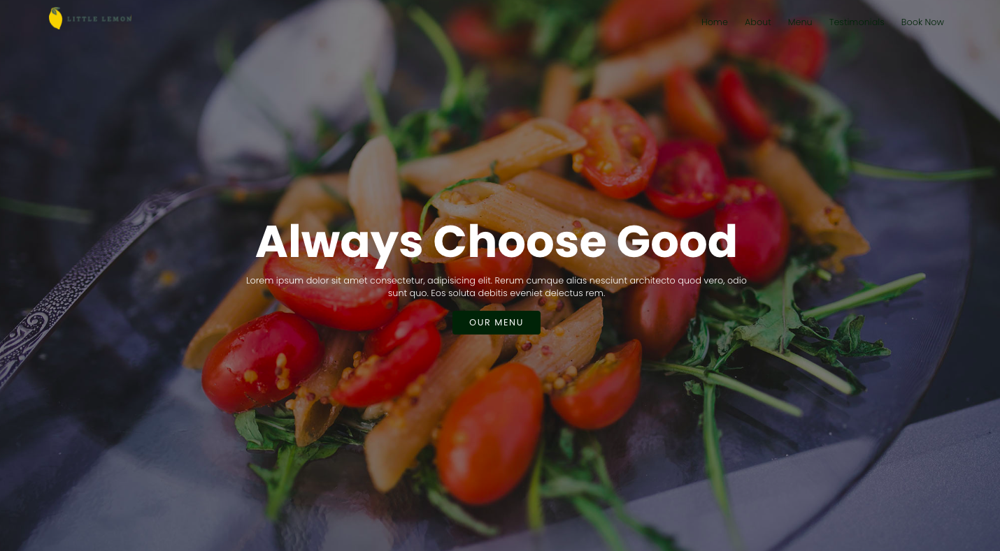
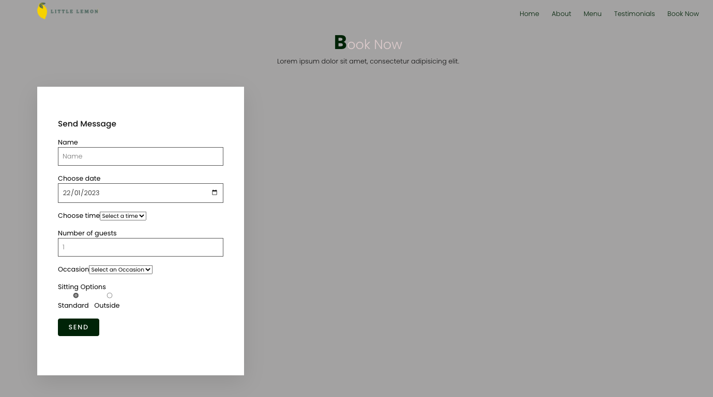
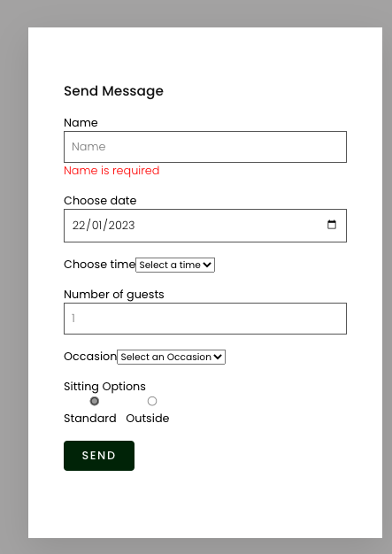
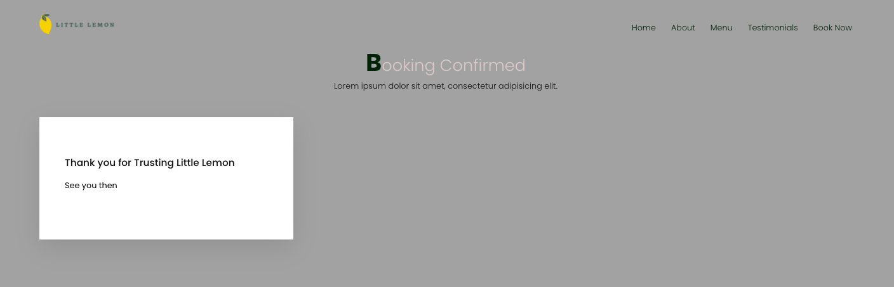

### Get started

### `git clone https://github.com/kagozi/FrontendCapstoneProject.git`

### Install the dependencies 

#### `npm i`

## Start a development server

### `npm start`
Runs the app in the development mode.\
Open [http://localhost:3000](http://localhost:3000) to view it in your browser.

## Run Unit tests

### `npm test`

Launches the test runner in the interactive watch mode.\
See the section about [running tests](https://facebook.github.io/create-react-app/docs/running-tests) for more information.

## IMPLEMENTED COMPONENTS

### LANDING PAGE

**Home page: /**

### BOOKING COMPONENT

**Implemeted to fetch data from an API endpoint `fetchAPI` and submit `formdata` to the endpoint `submitAPI` **

### FORM VALIDATION

**Performs client side validation to prevent incomplete or errornous formData from being posted. It also displays warnings for each error field **

### BOOKING CONFIRMATION

**Uses react.useNavigate() to redirect the user to a confirmation page once the validation check passes and the form submitted **

